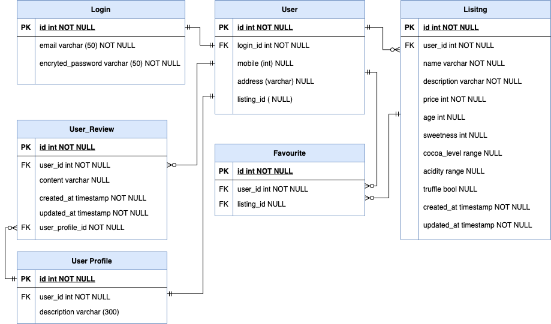
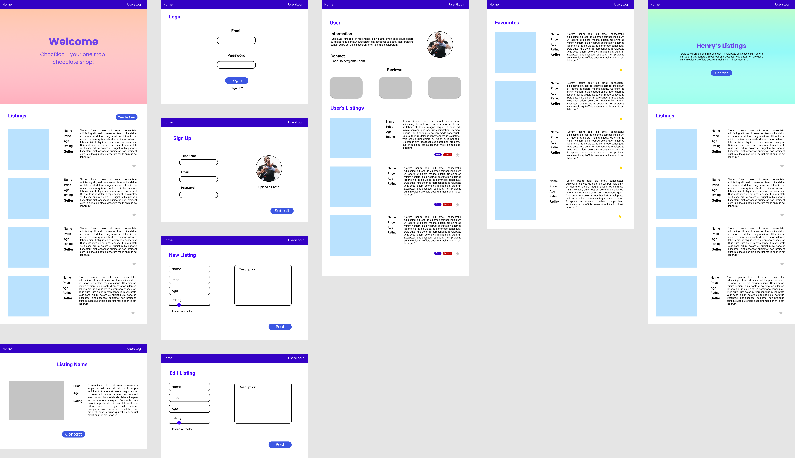
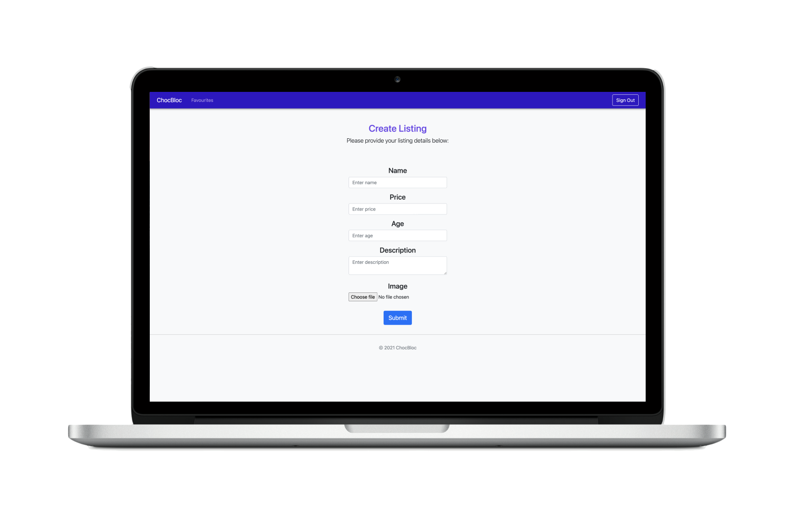
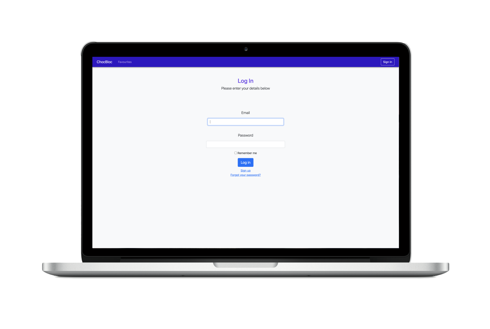
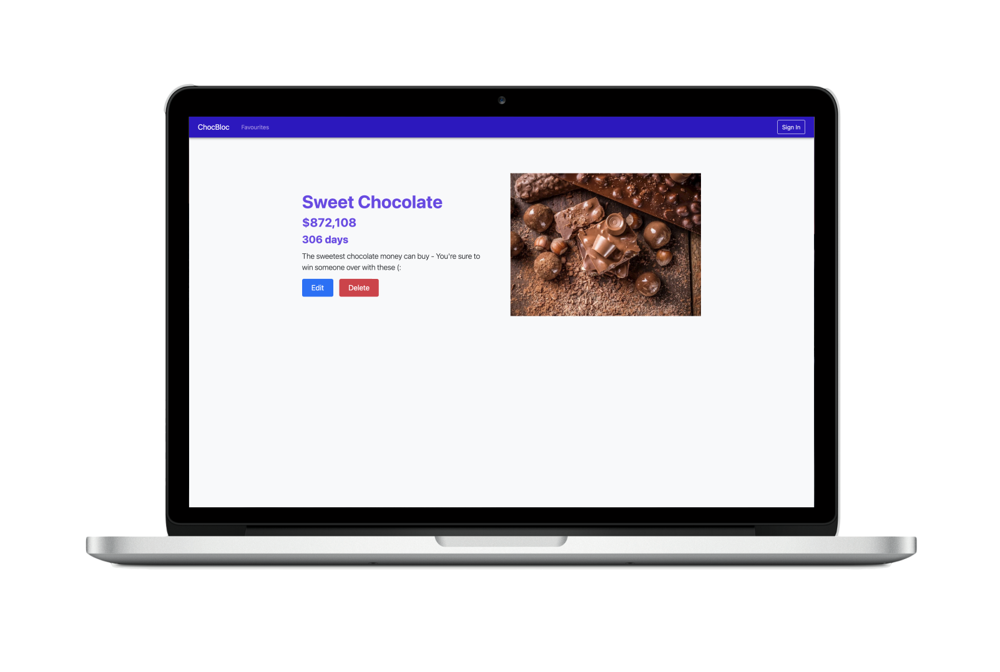
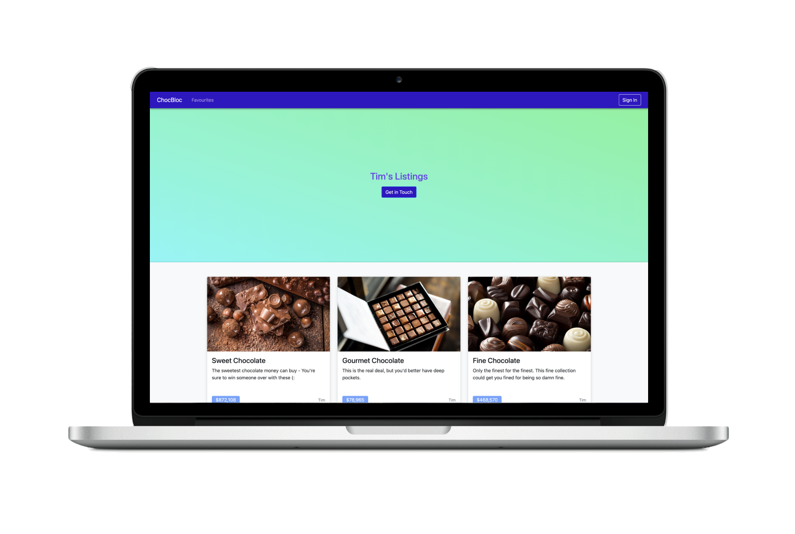

# ChocBloc

## Hackathon Project 

### Term 2 - Sydney Fast Track 2021 - Coder Academy

#### Team Bro Code

##### Henry Drayton & Garvey Chan

### Heroku Link
https://choc-bloc.herokuapp.com/

### Time Period

2 Days

### Purpose 

Create a marketplace to facilitate transactions between fine chocolate collectors.

### Requirements 

- CRUD app (create, read, update, delete)
- Rails
- ERB
- Authentication (devise)
- Deploy the app (heroku)
- Git workflow: collaborate, working on branches, pull requests, merging

### How to

- Pair programming (2 per team)
- Work on basics of the app together: user stories, ERD, basic
- Wireframe, model generation, routes
- Get the basics: views, forms, authentication, logic in controllers, model methods, basic styling, deployment, etc(devise)
       
### Entity Relationship Diagram 

### User Stories

As a <strong>buyer</strong> I want to view all available chocos on the market.

As a <strong>buyer</strong> I want to be able to view a seller's catalogue. 

As a <strong>buyer</strong> I want to be able to view a seller's profile (info and reviews).

As a <strong>buyer</strong> I want to be able to add a review to the seller's profile.

As a <strong>buyer</strong> I want to be able to quickly contact the seller about buying a choco.

As a <strong>seller</strong> I want to be able to add seller information to my profile.

As a <strong>seller</strong> I want to provide contact details to potential buyers.

As a <strong>seller</strong> I want to be able to post a collectible chocolate.

As a <strong>seller</strong> I want to give attributes to my chocolate.

As a <strong>seller</strong> I want to be able to edit that listing.

As a <strong>seller</strong> I want to be able to remove a listing. 

### Wireframes

### Renders

